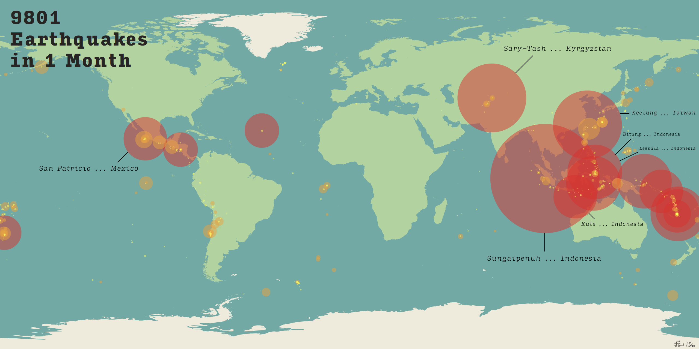

# Mapping Earthquakes

This project consists of mapping a monthly series of the world's earthquakes onto a world map. Using processing code, geolocation data was converted from latitude and longitude coordinates onto a pixel scale so as to be placed on a .svg map file.

The final image after touching it up in Adobe Illustrator may be found below:

